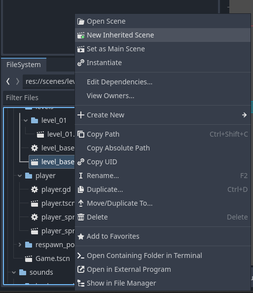
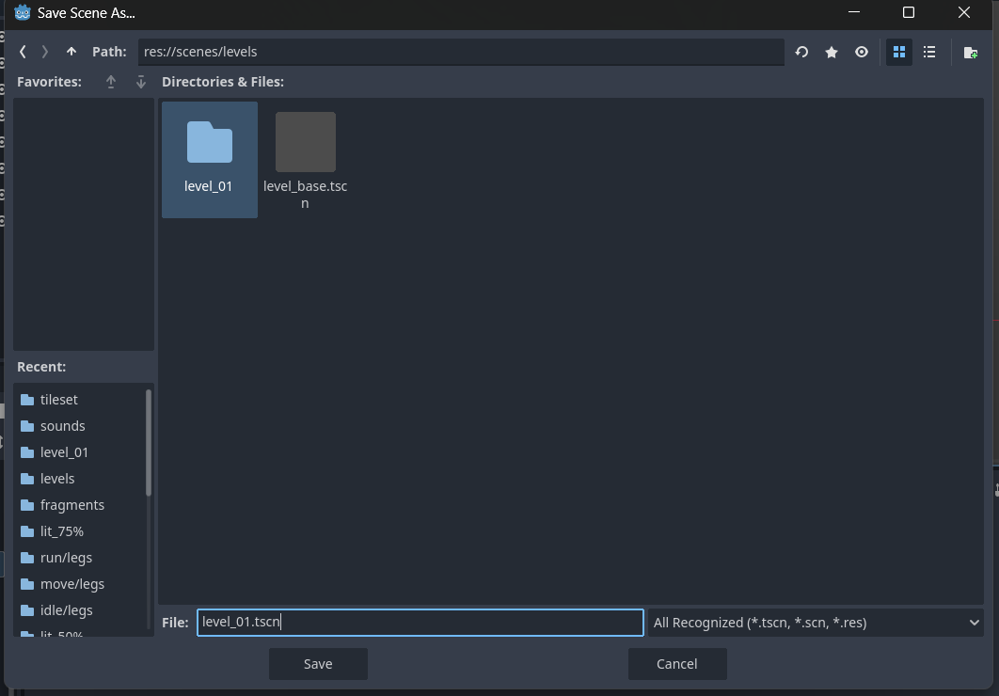
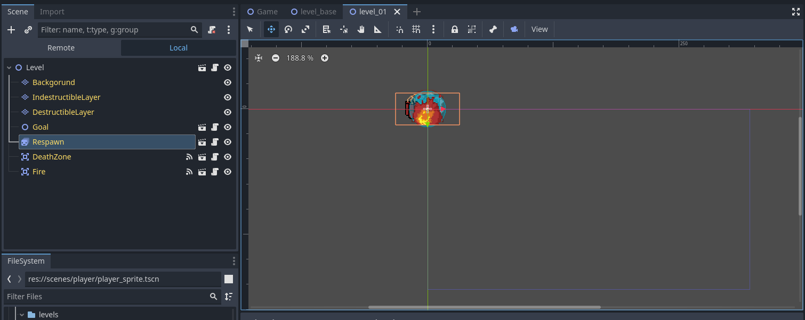
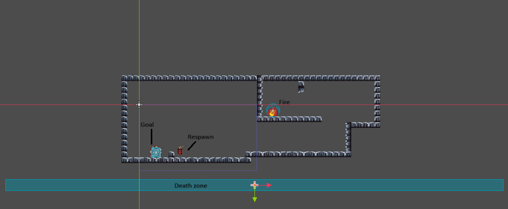

## Create new inherited scene from `scene/levels/level_base.tscn`

## Save scene into a separate folder under `scenes/levels`

Remember to rename the new scene

## Create the level

Initially the scene will have all the elements placed in the origin.
A scene by default will have:

- A goal
- A fire instance
- A death zone
- A spawn point
- 3 TileMapLayers
  - Background
  - Indestructible
  - Destructible

The proper tilesets are properly configured in the parent scene.

This is how the inherited scene will look initially:

And here is an example of a concrete level

## Extend level base script

With the steps above you'll manage to create a level with the exact same funcitonalities as the *level_base.tscn* scene.
If tailored behaviors are needed, you can

1. Detach the script from the inherited scene (i.e., from the new level created)
2. Attach a new script that extends the class **Level**

In the new script you can then override level base methods and/or add functionalities specific to the level you want to create.
